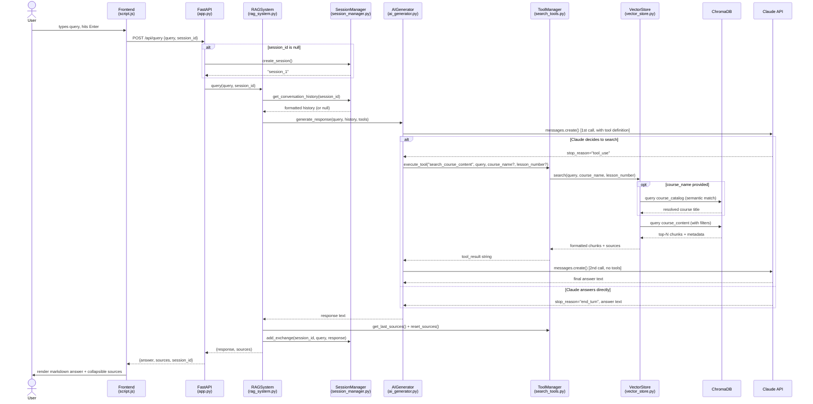

# Query Trace: Frontend to Backend

## Diagram




## 1. Frontend — User Submits (`script.js:45`)

```
User types query → presses Enter or clicks Send
    → sendMessage() called
    → UI disabled, loading indicator shown
    → POST /api/query  { query: "...", session_id: "session_1" | null }
```

On the very first message, `session_id` is `null` — the backend will create one.

---

## 2. FastAPI Route (`app.py:56`)

```python
POST /api/query  →  query_documents(request: QueryRequest)
```

- If `request.session_id` is `None`, calls `rag_system.session_manager.create_session()` to generate `"session_1"`, `"session_2"`, etc.
- Calls `rag_system.query(request.query, session_id)`

---

## 3. RAG Orchestrator (`rag_system.py:102`)

```python
RAGSystem.query()
    1. Wraps query: "Answer this question about course materials: {query}"
    2. Fetches conversation history from SessionManager (formatted as "User: ...\nAssistant: ...")
    3. Calls ai_generator.generate_response(query, history, tools, tool_manager)
```

The session history (up to last 5 exchanges = 10 messages) is injected into Claude's system prompt.

---

## 4. First Claude Call (`ai_generator.py:43`)

```python
AIGenerator.generate_response()
    → client.messages.create(
        model=...,
        system=SYSTEM_PROMPT + conversation_history,
        messages=[{ "role": "user", "content": query }],
        tools=[search_course_content tool definition],
        tool_choice="auto"
    )
```

Claude now decides: does this need a search, or can it answer from general knowledge?

---

## 5a. Claude decides to search — Tool Use (`ai_generator.py:83`)

```
response.stop_reason == "tool_use"
    → _handle_tool_execution() called
```

```python
# Messages so far:
[
  { role: "user",      content: "Answer this question..." },
  { role: "assistant", content: [TextBlock, ToolUseBlock(name="search_course_content", input={query, course_name?, lesson_number?})] }
]
```

---

## 6. Tool Execution (`search_tools.py:52`)

```python
ToolManager.execute_tool("search_course_content", query=..., course_name=..., lesson_number=...)
    → CourseSearchTool.execute()
        → VectorStore.search()
```

Inside `VectorStore.search()` (`vector_store.py:61`):
1. If `course_name` given → semantic lookup in `course_catalog` collection to resolve to exact title (`_resolve_course_name`)
2. Build ChromaDB `where` filter (by `course_title`, `lesson_number`, or both)
3. Query `course_content` collection with `query_texts=[query]`, returns top-N chunks

Results formatted as:
```
[Course Title - Lesson 2]
...chunk text...

[Course Title - Lesson 3]
...chunk text...
```

Sources (e.g. `"Course Title - Lesson 2"`) stored in `CourseSearchTool.last_sources`.

---

## 7. Second Claude Call (`ai_generator.py:127`)

```python
# Messages now:
[
  { role: "user",      content: "Answer this question..." },
  { role: "assistant", content: [ToolUseBlock] },
  { role: "user",      content: [{ type: "tool_result", tool_use_id: ..., content: "...chunks..." }] }
]
# Tools NOT passed this time — forces a text response
→ client.messages.create(...)
→ returns final answer text
```

---

## 5b. Claude answers directly (no tool use)

If Claude determines it's a general knowledge question, `stop_reason == "end_turn"` and `response.content[0].text` is returned immediately — no second call needed.

---

## 8. Back in RAGSystem (`rag_system.py:130`)

```python
sources = tool_manager.get_last_sources()   # ["Course Title - Lesson 2", ...]
tool_manager.reset_sources()                 # clear for next query
session_manager.add_exchange(session_id, query, response)  # persist history
return response, sources
```

---

## 9. Back in FastAPI (`app.py:68`)

```python
return QueryResponse(answer=response, sources=sources, session_id=session_id)
```

---

## 10. Frontend receives response (`script.js:76`)

```javascript
data = { answer: "...", sources: ["..."], session_id: "session_1" }
currentSessionId = data.session_id   // saved for next message
loadingMessage.remove()
addMessage(data.answer, 'assistant', data.sources)
// → markdown rendered via marked.parse()
// → sources shown in collapsible <details> element
```

---

## Summary Flow Diagram

```
User input
  └→ fetch POST /api/query
       └→ app.py: create session if needed
            └→ rag_system.query()
                 ├→ session_manager: get history
                 └→ ai_generator: 1st Claude call (with tool)
                      ├─ [no tool] → return answer directly
                      └─ [tool_use] → execute search_course_content
                           └→ vector_store.search() → ChromaDB
                                └→ 2nd Claude call (with chunks) → final answer
                 └→ session_manager: save exchange
  └→ render markdown + sources in UI
```
